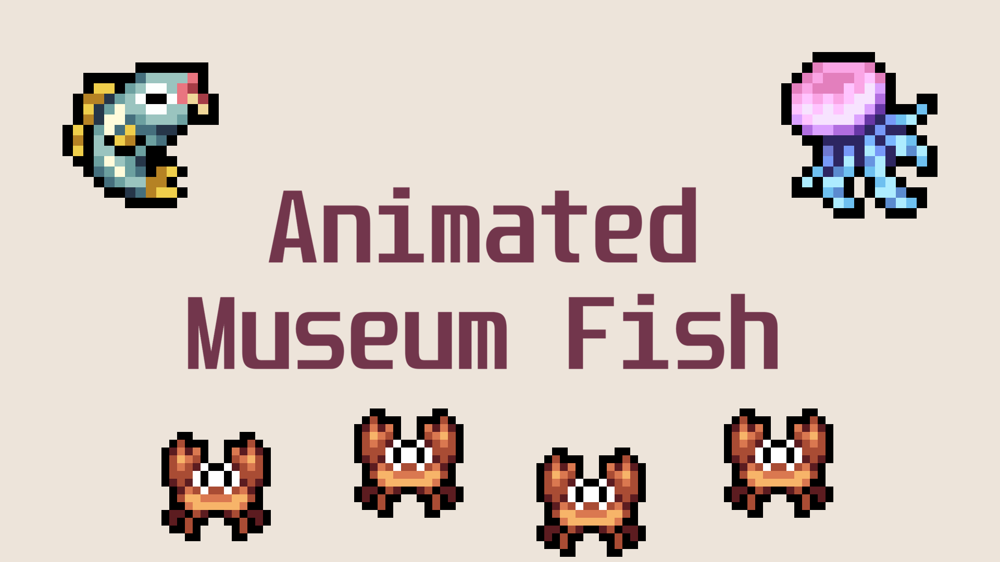

# Fields of Mistria - Animated Museum Fish

Fields of Mistria mod to animate fish in the museum.

## Description

Animate fish in the museum displays to make them feel alive!
The display mod in the demo is my [Different Museum Displays Mod](https://www.nexusmods.com/fieldsofmistria/mods/976)

If you find an issue please let me know.

NOTE the demo gif is not fully representative of the game. The colors are slightly off from mp4->gif conversion and the 60->15fps (gameplay->gif) drop can make some fish look faster or slower than they actually are. In-game it looks smoother.

## Installation Instructions

1. Unzip file in your mods folder
   > C:\Program Files (x86)\Steam\steamapps\common\Fields of Mistria\mods
2. Install using [MOMI](https://www.nexusmods.com/fieldsofmistria/mods/78) (>= 0.15 required)

## Magikarp Mode and other options

Downward facing fish and magikarp mode can be enabled thru Mod Configs

