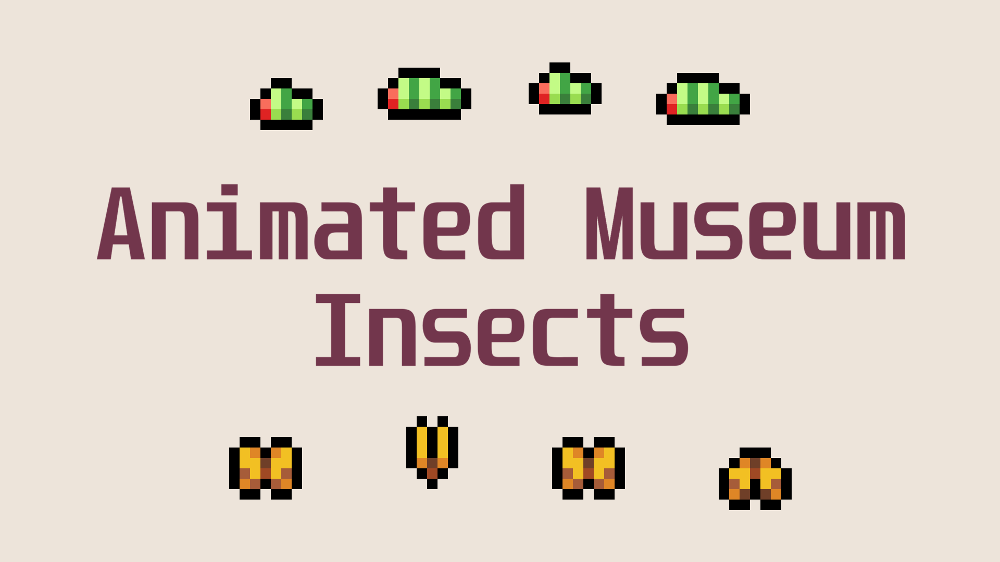

# Fields of Mistria - Animated Museum Insects

Fields of Mistria mod to animate insects in the museum.

## Description

Animate insects in the museum displays to make them feel alive!
The display mod in the demo is my [Different Museum Displays Mod](https://www.nexusmods.com/fieldsofmistria/mods/976)

I only have 23 insects so far so haven't been able to confirm if everything looks correct for others. If you find an issue please let me know.

NOTE the demo gif is not fully representative of the game. The colors are slightly off from mp4->gif conversion and the 60->15fps (gameplay->gif) drop can make some insects look faster or slower than they actually are. In-game it looks smoother.

## Installation Instructions

1. Unzip file in your mods folder
   > C:\Program Files (x86)\Steam\steamapps\common\Fields of Mistria\mods
2. Install using [MOMI](https://www.nexusmods.com/fieldsofmistria/mods/78) (>= 0.15 required)
